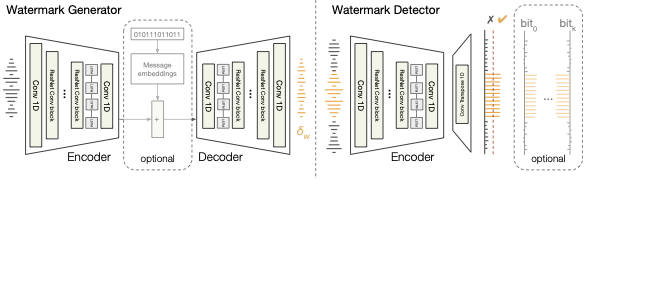

# :loud_sound: Slowat: Proactive Localized Watermarking
<a href="https://www.python.org/"></a>
<a href="https://black.readthedocs.io/en/stable/"></a>

We introduce AudioSeal, a method for speech localized watermarking. It jointly trains a generator that embeds a watermark in the audio, and a detector that detects it at the sample level, even in the presence of editing. Slowat achieves state-of-the-art detection performance  of both natural and synthetic speech at the sample level, it generates limited alteration of signal quality and is robust to many types of audio editing.

<p align="center">

</p>


# :mate: Installation

1. Install packages in a conda environment
    - Conda is a common package management system, and it's recommended that you make a new conda environment for each project, and install all packages (e.g. pytorch, matplotlib) within your project's environment. Conda should be installed on your dev machine, and if needed, you can find more about using conda at FAIR [here](https://www.internalfb.com/intern/wiki/FAIR/Platforms/Clusters/FAIRClusters/FAIRClusterFAQ/#managing-the-software-en) and a command cheat sheet [here](https://docs.conda.io/projects/conda/en/4.6.0/_downloads/52a95608c49671267e40c689e0bc00ca/conda-cheatsheet.pdf). 
    - `cd` into repo directory `cd my_repository`
    - Install a starter set of packages: 
      - ```conda create -n fair-recipe --clone /checkpoint/marksibrahim/fair-recipes/fair-recipe-shared && conda activate fair-recipe && pip install -e .```
    - <details>
        <summary>Manual Installation (only for the brave)</summary>

      1. Install conda
      2. `conda create -n fair-recipe python=3.11`
      3. `conda activate fair-recipe`
      4. `pip install torch==2.1 torchvision torchaudio --index-url https://download.pytorch.org/whl/cu118` (see [official instructions](https://pytorch.org/get-started/locally/), you need to check your cuda driver with `nvidia-smi` and install a pytorch version that is compatible with yours, see Cuda website for compatibility between version and driver, [example](https://docs.nvidia.com/cuda/archive/12.1.0/cuda-toolkit-release-notes/))
      5. `pip install pytest submitit hydra-core hydra-submitit-launcher loguru tqdm`
      6. `pip install -e .`      
    </details>

# :abacus: Usage

skowat provides a simple API to watermark and detect the watermarkings from an audio sample. Example usage:

```python

from slowat.models import Watermarker

model = Watermarker.from_pretrained("facebook/audioseal_16bits")

# Other way is to load directly from the checkpoint
# model =  Watermarker.from_pretrained(checkpoint_path, device = wav.device)

watermark = model.get_watermark(wav)
watermarked_audio = wav + watermark

# Generate the secret kbits messages as a tensor of shape (batch, k)
message (torch.Tensor): Message to encode in the audio signal of shape (B, nbits).

detection = model.detect_watermark(watermarked_audio)

print(detection[:,1,:])  # print prob of watermarked class # should be > 0.5


```python

```


`python main.py -m mode=local`

**Goodies baked in**

:white_check_mark:	 Launch the same code locally or on the cluster easily: `mode=local` or `mode=cluster`

:white_check_mark:	 Sweep over parameters in parallel: `python main.py -m datamodule.batch_size=4,8,16`

:white_check_mark:	 Hydra configs, in human readable, composable `yaml` files: `python main.py -m model=cnn dataset=cifar10`

:white_check_mark:	 Includes a simple `setup.py` to save you from import headaches

:white_check_mark:	 Smart logging that shows function inputs, colors outputs, and tracks timestamps thanks to [Loguru](https://github.com/Delgan/loguru)

:white_check_mark:	 Basic unit tests built-in: `python -m pytest tests/`

# :ice_cube: Evaluation

Our evaluation 

The repo structures code around three compoenents common to most machine learning research: 1) Data, 2) Model, 3) Experiment Logic

```md
├── datasets.py
├── models.py
├── train.py # experiment logic
├── main.py # launcher
├── configs/
│   ├── train_defaults.yaml
│   ├── dataset/
│   ├── model/
│   └── mode/ # configs for launching on cluster or locally
├── tests/
```

# :file_folder: Data & Storage
### Accessing Research Datasets
FAIR hosts the majority of common research datasets on the FAIR Cluster, in a folder called datasets01 (`cd /datasets01`). Always check datasets01 before individually downloading a research dataset!

### Storing Your Stuff:
- **Storing Code**: all of your code should be stored in the 'projects' folder on your dev machine. This projects folder exists at 'private/home/{username}/projects/'. This project folder is synced between different dev machines, so if you switch dev machines, you can still access your code. 

- **Storing Models, Experiment Logs, or Datasets**: each user has a 'checkpoint' folder that has two main properties: 1) It has much more storage than your projects folder, and 2) it can be accessed by others in FAIR, making it easy to share models or results with your team. Your checkpoint folder is located at '/checkpoint/{username}/'. You can cd into it by running 'cd checkpoint/{username}'. 


# :brain: Compute
There are several types of compute you have access to at FAIR, and this code is designed to allow you to quickly switch between them depending on the scale of your experiment. 

- **Devfair local GPUs**: each devfair has 2-4 GPUs which are shared among a few users of the devfair. This is great for testing code, or running small scale, quick experiments. However, all major experiments should be run on the cluster, which has built-in safety mechanisms for data processing and compute that prevent many job failures. In this codebase, you can run code on the local GPUs by setting mode to 'local'. 

- **FAIR Cluster**: the cluster is the massive set of GPUs which we use for pretty much all experiments. In this codebase, you can run code on the cluster by setting the mode to 'cluster'. You can specify the numer of GPUs or other parameters in the cluster config file (configs/mode/cluster.yaml). Partitions are groups of GPUs on the cluster that are designated for different teams or priority levels. Most FAIR users run their experiments on the general partition called devlab (the default for this repository).  

- **Have a question about compute?** You can look through the [FAIR Cluster Wiki](https://www.internalfb.com/intern/wiki/FAIR/Platforms/Clusters/FAIRClusters/), search the [FAIR Cluster Discussion & Support Workplace Group](https://fb.workplace.com/groups/FAIRClusterUsers/), or ask your managers!

# :wrench: Other tips and tools

* Log experiments using [Weights and Biases](https://fb.workplace.com/groups/623655025018541) available at FAIR
* Snapshot code so you can develop before jobs are queued in SLURM, based on [Matt Le's Sync Code](https://fb.workplace.com/groups/airesearchinfrausers/posts/1774890499334188/?comment_id=1774892729333965&reply_comment_id=1775084782648093)
* Don't rely on Jupyter notebooks for code you'll need to reuse, instead write functions in modules (`.py` files) and call them in your notebook. Use [AutoReload](https://ipython.org/ipython-doc/3/config/extensions/autoreload.html) to make this seamless
* Hydra has autocompletion, run `eval "$(python train.py -sc install=bash)"` . Consult [this guide](https://hydra.cc/docs/tutorials/basic/running_your_app/tab_completion/) for setup details
* Setup code formatting so code is readable (and no one quibbles over style). We recommend the [Black Formatter](https://github.com/psf/black) (used in this repo)
* Loading modules and environments in your bash_profile. 
  <details>
    <summary> Vivien C.'s Example</summary>

    ```bash
    export CONDAENV_HOME="/private/home/$USER/.conda/envs"

    # Load cuda modules and the fair-recipe conda env
    if [ -r $CONDAENV_HOME/fair-recipe ]; then
      dev() {
        module purge
        module load anaconda3/2023.3-1 cuda/11.7 cudnn/v8.4.1.50-cuda.11.6
        conda activate fair-recipe
      }
    fi
    ```
  </details>
* If you're stuck, consult the [FAIR Cluster Wiki](https://www.internalfb.com/intern/wiki/FAIR/Platforms/Clusters/FAIRClusters/). If you're still stuck, post a question in the [Workplace Group](https://fb.workplace.com/groups/airesearchinfrausers).
  <details>
    <summary> Multi-GPU Distributed Training Options</summary>
    
    * Native [PyTorch DDP](https://pytorch.org/tutorials/intermediate/ddp_tutorial.html): for those who are brave and don't want to rely on other libraries.
    * [Torch TNT](https://pytorch.org/tnt/stable/): light-weight trainer supported internally.
    * [Accelerate](https://github.com/huggingface/accelerate): less abstraction, lighter-weight trainer that doesn't replace standard loop
    * [PyTorch Lightning](https://lightning.ai/docs/pytorch/stable/): heavier weight with bells and whistles, but more abstraction.
    * Hugging Face Trainer: heavier weight, but popular trainer integrated with the many models available on HuggingFace.
    * Mosaic Composer: optimized trainer with fast data loading using FFCV and other bells and whistles.
  </details>

# Want to contribute?

 We welcome [Pull Requests](https://github.com/fairinternal/fair-getting-started-recipe/pulls) with improvements or suggestions.
 If you want to flag an issue or propose an improvement, but dont' know how to realize it, create a [GitHub Issue](https://github.com/fairinternal/fair-getting-started-recipe/issues).


# Thanks to
* Jack Urbaneck, Matthew Muckley, Pierre Gleize,  Ashutosh Kumar, Megan Richards, Haider Al-Tahan, and Vivien Cabannes for contributions and feedback
* The CIFAR10 [PyTorch Tutorial](https://pytorch.org/tutorials/beginner/blitz/cifar10_tutorial.html
) on which the training is based 
* [Hydra Lightning Template](https://github.com/ashleve/lightning-hydra-template) for inspiration on code organization
